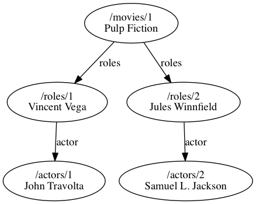

# Jesi - a hypermedia API accelerator

Jesi (stands for JSON Edge Side Include) is an HTTP reverse proxy that accelerates your web API by embedding & caching JSON representations.

## Getting Started

Install Jesi from GitHub Releases (pick a binary for your platform):

```sh
$ curl -L https://github.com/ichiban/jesi/releases/download/v0.2.0/jesi-darwin-amd64 > jesi
$ chmod +x jesi
```

Then, run it with your backend server:

```sh
$ ./jesi -backend http://localhost:3000 -port 8080
```
 
## Features

### Embedding

Jesi understands [JSON Hypertext Application Language aka HAL+JSON](http://tools.ietf.org/html/draft-kelly-json-hal) and can construct complex HAL+JSON documents out of simple HAL+JSON documents from the upstream server.
By supplying a query parameter `?with=<edges>` with dot separated edge names, it embeds HAL+JSON documents linked by `_links` as `_embeded`. (This functionality is also known as **zooming**)

This will decrease the number of round trips over the Internet which is crucial for speeding up web API backed applications.

### Caching

Jesi implements HTTP Caching described in [RFC 7234](https://tools.ietf.org/html/rfc7234).
Every representation including but not limited to HAL+JSON documents is cached and served from the cache on behalf of the upstream server while it's fresh.

Combined with embedding, the resulting HAL+JSON representation is constructed from cached representations and representations newly fetched from the upstream server so that it can maximize cache effectiveness.

When Jesi cache reaches the memory limitation specified by `-max` command line option, it evicts some cached representations with LRU algorithm.
Also, Jesi supports a de facto standard HTTP method `PURGE` to delete cached representations of a resource.

## Example

Let's consider an example of a movie database app. It has resources of a movie Pulp Fiction, roles Vincent Vega and Jules Winnfield, and actors John Travolta and Samuel L. Jackson.

```json
{
  "_links": {
    "self": {"href": "/movies/1"},
    "roles": [{"href": "/roles/1"}, {"href": "/roles/2"}]
  },
  "title": "Pulp Fiction",
  "year": 1994
}
```

```json
{
  "_links": {
    "self": {"href": "/roles/1"},
    "actor": {"href": "/actors/1"},
    "movie": {"href": "/movies/1"}
  },
  "name": "Vincent Vega"
}
```

```json
{
  "_links": {
    "self": {"href": "/roles/2"},
    "actor": {"href": "/actors/2"},
    "movie": {"href": "/movies/1"}
  },
  "name": "Jules Winnfield"
}
```

```json
{
  "_links": {
    "self": {"href": "/actors/1"},
    "roles": [{"href": "/roles/1"}]
  },
  "name": "John Travolta"
}
```

```json
{
  "_links": {
    "self": {"href": "/actors/2"},
    "roles": [{"href": "/roles/2"}]
  },
  "name": "Samuel L. Jackson"
}
```

They're connected by `_links` property - a movie has many roles and a role has exactly one actor.



To render a view for Pulp Fiction, it has to make requests for the movie `/movies/1` and also `/roles/1`, `/roles/2`, `/actors/1`, and `/actors/2` for the details.
By making a request `/movies/1?with=roles.actor`, Jesi responds with one big HAL+JSON document with the roles and actors embedded in the movie JSON.

```json
{
  "_links": {
    "self": {"href": "/movies/1"},
    "roles": [{"href": "/roles/1"}, {"href": "/roles/2"}]
  },
  "_embedded": {
    "roles": [
      {
        "name": "Vincent Vega",
        "_links": {
          "self": {"href": "/roles/1"},
          "actor": {"href": "/actors/1"},
          "movie": {"href": "/movies/1"}
        },
        "_embedded": {
          "actor": {
            "name": "John Travolta",
            "_links": {
              "self": {"href": "/actors/1"},
              "roles": [{"href": "/roles/1"}]
            }
          }
        }
      },
      {
        "name": "Jules Winnfield",
        "_links": {
          "self": {"href": "/roles/2"},
          "actor": {"href": "/actors/2"},
          "movie": {"href": "/movies/1"}
        },
        "_embedded": {
          "actor": {
            "name": "Samuel L. Jackson",
            "_links": {
              "self": {"href": "/actors/2"},
              "roles": [{"href": "/roles/2"}]
            }
          }
        }
      }
    ]
  },
  "title": "Pulp Fiction",
  "year": 1994
}
```
